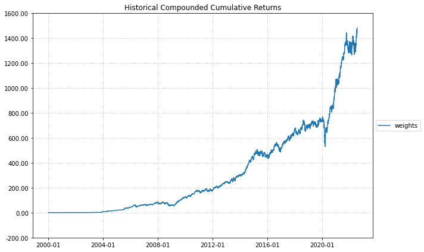
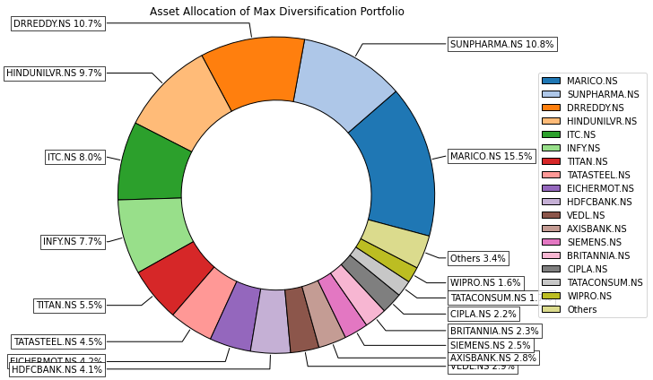
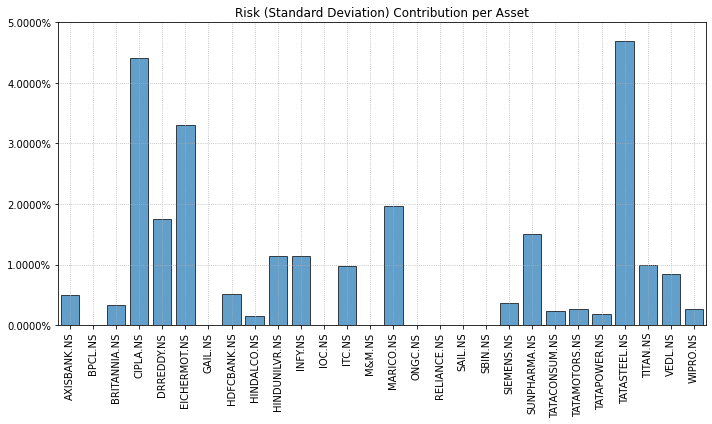
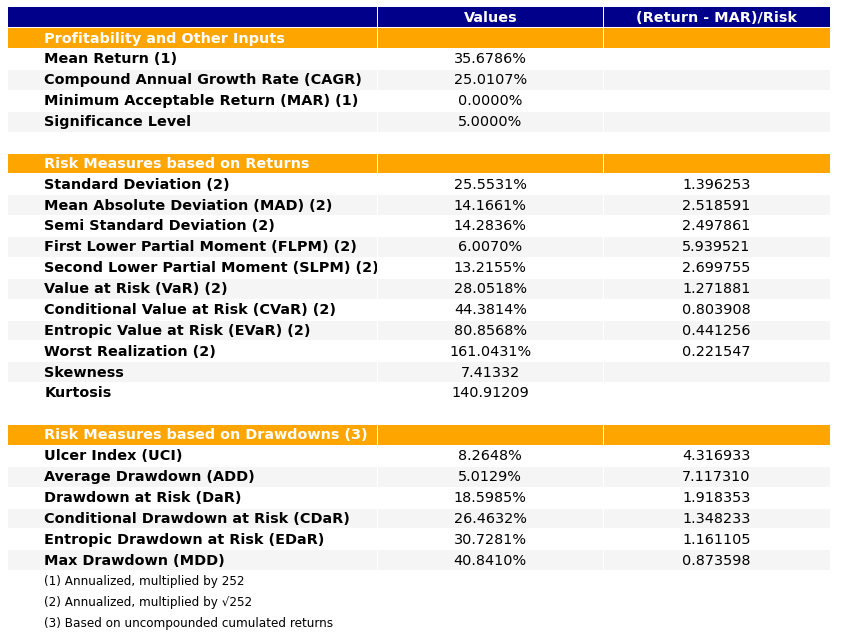
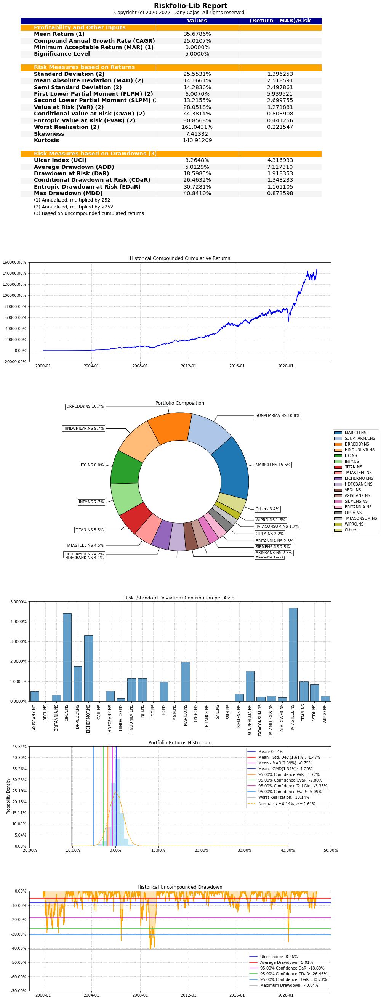

```python
import numpy as np
import pandas as pd
import yfinance as yf
import warnings
import riskfolio as rp

warnings.filterwarnings("ignore")
pd.options.display.float_format = '{:.2%}'.format

# Date range
start = '2000-01-01'
end = '2022-07-31'

# Tickers of assets
assets = """AXISBANK.NS	BPCL.NS	BRITANNIA.NS	CIPLA.NS	DRREDDY.NS	EICHERMOT.NS	GAIL.NS	HDFCBANK.NS	HINDALCO.NS	HINDUNILVR.NS	INFY.NS	IOC.NS	ITC.NS	M&M.NS	MARICO.NS	ONGC.NS	RELIANCE.NS	SAIL.NS	SBIN.NS	SIEMENS.NS	SUNPHARMA.NS	TATACONSUM.NS	TATAMOTORS.NS	TATAPOWER.NS	TATASTEEL.NS	TITAN.NS	VEDL.NS	WIPRO.NS""".split("\t")

#assets = [x + ".NS" for x in assets]
assets.sort()

# Downloading data
data = yf.download(assets, start=start, end=end)
data = data.loc[:, ('Adj Close', slice(None))]
data.columns = assets
Y = data[assets].pct_change().dropna()
display(Y.head())


```

    [*********************100%***********************]  28 of 28 completed


<div>
<style scoped>
    .dataframe tbody tr th:only-of-type {
        vertical-align: middle;
    }

    .dataframe tbody tr th {
        vertical-align: top;
    }

    .dataframe thead th {
        text-align: right;
    }
</style>
<table border="1" class="dataframe">
  <thead>
    <tr style="text-align: right;">
      <th></th>
      <th>AXISBANK.NS</th>
      <th>BPCL.NS</th>
      <th>BRITANNIA.NS</th>
      <th>CIPLA.NS</th>
      <th>DRREDDY.NS</th>
      <th>EICHERMOT.NS</th>
      <th>GAIL.NS</th>
      <th>HDFCBANK.NS</th>
      <th>HINDALCO.NS</th>
      <th>HINDUNILVR.NS</th>
      <th>...</th>
      <th>SBIN.NS</th>
      <th>SIEMENS.NS</th>
      <th>SUNPHARMA.NS</th>
      <th>TATACONSUM.NS</th>
      <th>TATAMOTORS.NS</th>
      <th>TATAPOWER.NS</th>
      <th>TATASTEEL.NS</th>
      <th>TITAN.NS</th>
      <th>VEDL.NS</th>
      <th>WIPRO.NS</th>
    </tr>
    <tr>
      <th>Date</th>
      <th></th>
      <th></th>
      <th></th>
      <th></th>
      <th></th>
      <th></th>
      <th></th>
      <th></th>
      <th></th>
      <th></th>
      <th></th>
      <th></th>
      <th></th>
      <th></th>
      <th></th>
      <th></th>
      <th></th>
      <th></th>
      <th></th>
      <th></th>
      <th></th>
    </tr>
  </thead>
  <tbody>
    <tr>
      <th>2000-01-04</th>
      <td>3.86%</td>
      <td>-7.20%</td>
      <td>-0.31%</td>
      <td>0.54%</td>
      <td>8.00%</td>
      <td>5.22%</td>
      <td>-3.42%</td>
      <td>2.24%</td>
      <td>3.79%</td>
      <td>-1.15%</td>
      <td>...</td>
      <td>6.34%</td>
      <td>0.29%</td>
      <td>-1.34%</td>
      <td>-2.41%</td>
      <td>-3.94%</td>
      <td>0.20%</td>
      <td>-1.08%</td>
      <td>-5.33%</td>
      <td>-1.42%</td>
      <td>8.00%</td>
    </tr>
    <tr>
      <th>2000-01-05</th>
      <td>-2.60%</td>
      <td>-2.85%</td>
      <td>-2.55%</td>
      <td>-2.06%</td>
      <td>-3.74%</td>
      <td>8.07%</td>
      <td>-4.75%</td>
      <td>-3.94%</td>
      <td>8.00%</td>
      <td>-3.56%</td>
      <td>...</td>
      <td>-4.11%</td>
      <td>-4.40%</td>
      <td>-3.51%</td>
      <td>-4.17%</td>
      <td>2.43%</td>
      <td>1.95%</td>
      <td>3.81%</td>
      <td>-6.11%</td>
      <td>-0.61%</td>
      <td>1.63%</td>
    </tr>
    <tr>
      <th>2000-01-06</th>
      <td>-2.48%</td>
      <td>5.65%</td>
      <td>6.85%</td>
      <td>-5.52%</td>
      <td>5.96%</td>
      <td>8.01%</td>
      <td>2.77%</td>
      <td>0.81%</td>
      <td>7.83%</td>
      <td>4.01%</td>
      <td>...</td>
      <td>5.05%</td>
      <td>1.44%</td>
      <td>-0.10%</td>
      <td>3.34%</td>
      <td>4.15%</td>
      <td>3.12%</td>
      <td>7.47%</td>
      <td>8.02%</td>
      <td>4.65%</td>
      <td>-1.93%</td>
    </tr>
    <tr>
      <th>2000-01-07</th>
      <td>-4.89%</td>
      <td>-0.12%</td>
      <td>8.00%</td>
      <td>-7.99%</td>
      <td>-7.97%</td>
      <td>7.75%</td>
      <td>-3.54%</td>
      <td>0.03%</td>
      <td>4.44%</td>
      <td>5.45%</td>
      <td>...</td>
      <td>4.71%</td>
      <td>-7.96%</td>
      <td>-8.00%</td>
      <td>7.97%</td>
      <td>8.01%</td>
      <td>-0.19%</td>
      <td>2.20%</td>
      <td>-2.11%</td>
      <td>-2.35%</td>
      <td>-8.00%</td>
    </tr>
    <tr>
      <th>2000-01-10</th>
      <td>3.09%</td>
      <td>1.34%</td>
      <td>7.51%</td>
      <td>-3.34%</td>
      <td>-1.65%</td>
      <td>1.31%</td>
      <td>-0.56%</td>
      <td>-1.46%</td>
      <td>-6.58%</td>
      <td>0.76%</td>
      <td>...</td>
      <td>-1.39%</td>
      <td>-1.82%</td>
      <td>-4.59%</td>
      <td>0.88%</td>
      <td>7.90%</td>
      <td>7.00%</td>
      <td>5.99%</td>
      <td>-0.99%</td>
      <td>2.15%</td>
      <td>0.14%</td>
    </tr>
  </tbody>
</table>
<p>5 rows × 28 columns</p>
</div>


```python
prices = data
display(prices.dropna().head())

```


<div>
<style scoped>
    .dataframe tbody tr th:only-of-type {
        vertical-align: middle;
    }

    .dataframe tbody tr th {
        vertical-align: top;
    }

    .dataframe thead th {
        text-align: right;
    }
</style>
<table border="1" class="dataframe">
  <thead>
    <tr style="text-align: right;">
      <th></th>
      <th>AXISBANK.NS</th>
      <th>BPCL.NS</th>
      <th>BRITANNIA.NS</th>
      <th>CIPLA.NS</th>
      <th>DRREDDY.NS</th>
      <th>EICHERMOT.NS</th>
      <th>GAIL.NS</th>
      <th>HDFCBANK.NS</th>
      <th>HINDALCO.NS</th>
      <th>HINDUNILVR.NS</th>
      <th>...</th>
      <th>SBIN.NS</th>
      <th>SIEMENS.NS</th>
      <th>SUNPHARMA.NS</th>
      <th>TATACONSUM.NS</th>
      <th>TATAMOTORS.NS</th>
      <th>TATAPOWER.NS</th>
      <th>TATASTEEL.NS</th>
      <th>TITAN.NS</th>
      <th>VEDL.NS</th>
      <th>WIPRO.NS</th>
    </tr>
    <tr>
      <th>Date</th>
      <th></th>
      <th></th>
      <th></th>
      <th></th>
      <th></th>
      <th></th>
      <th></th>
      <th></th>
      <th></th>
      <th></th>
      <th></th>
      <th></th>
      <th></th>
      <th></th>
      <th></th>
      <th></th>
      <th></th>
      <th></th>
      <th></th>
      <th></th>
      <th></th>
    </tr>
  </thead>
  <tbody>
    <tr>
      <th>2000-01-03</th>
      <td>369.93%</td>
      <td>1301.46%</td>
      <td>5437.09%</td>
      <td>10032.76%</td>
      <td>32412.28%</td>
      <td>289.18%</td>
      <td>421.34%</td>
      <td>1429.23%</td>
      <td>5724.06%</td>
      <td>13538.52%</td>
      <td>...</td>
      <td>1642.36%</td>
      <td>4404.91%</td>
      <td>1212.04%</td>
      <td>3477.51%</td>
      <td>3293.15%</td>
      <td>430.95%</td>
      <td>204.14%</td>
      <td>698.82%</td>
      <td>100.56%</td>
      <td>8354.18%</td>
    </tr>
    <tr>
      <th>2000-01-04</th>
      <td>384.22%</td>
      <td>1207.74%</td>
      <td>5420.21%</td>
      <td>10087.14%</td>
      <td>35006.13%</td>
      <td>304.27%</td>
      <td>406.92%</td>
      <td>1461.18%</td>
      <td>5941.15%</td>
      <td>13383.04%</td>
      <td>...</td>
      <td>1746.50%</td>
      <td>4417.84%</td>
      <td>1195.79%</td>
      <td>3393.73%</td>
      <td>3163.25%</td>
      <td>431.79%</td>
      <td>201.93%</td>
      <td>661.56%</td>
      <td>99.13%</td>
      <td>9022.56%</td>
    </tr>
    <tr>
      <th>2000-01-05</th>
      <td>374.22%</td>
      <td>1173.35%</td>
      <td>5281.93%</td>
      <td>9879.24%</td>
      <td>33697.38%</td>
      <td>328.84%</td>
      <td>387.61%</td>
      <td>1403.59%</td>
      <td>6416.26%</td>
      <td>12906.93%</td>
      <td>...</td>
      <td>1674.71%</td>
      <td>4223.44%</td>
      <td>1153.81%</td>
      <td>3252.35%</td>
      <td>3239.97%</td>
      <td>440.21%</td>
      <td>209.63%</td>
      <td>621.17%</td>
      <td>98.53%</td>
      <td>9169.60%</td>
    </tr>
    <tr>
      <th>2000-01-06</th>
      <td>364.94%</td>
      <td>1239.68%</td>
      <td>5643.61%</td>
      <td>9334.00%</td>
      <td>35706.70%</td>
      <td>355.18%</td>
      <td>398.34%</td>
      <td>1414.94%</td>
      <td>6918.42%</td>
      <td>13425.00%</td>
      <td>...</td>
      <td>1759.31%</td>
      <td>4284.07%</td>
      <td>1152.69%</td>
      <td>3361.08%</td>
      <td>3374.43%</td>
      <td>453.97%</td>
      <td>225.29%</td>
      <td>670.99%</td>
      <td>103.11%</td>
      <td>8992.20%</td>
    </tr>
    <tr>
      <th>2000-01-07</th>
      <td>347.08%</td>
      <td>1238.22%</td>
      <td>6095.08%</td>
      <td>8588.44%</td>
      <td>32860.35%</td>
      <td>382.71%</td>
      <td>384.23%</td>
      <td>1415.36%</td>
      <td>7225.26%</td>
      <td>14156.90%</td>
      <td>...</td>
      <td>1842.22%</td>
      <td>3942.96%</td>
      <td>1060.49%</td>
      <td>3629.05%</td>
      <td>3644.87%</td>
      <td>453.13%</td>
      <td>230.25%</td>
      <td>656.85%</td>
      <td>100.69%</td>
      <td>8272.91%</td>
    </tr>
  </tbody>
</table>
<p>5 rows × 28 columns</p>
</div>


```python


# Building the portfolio object
port = rp.Portfolio(returns=Y)

# Calculating optimal portfolio

# Select method and estimate input parameters:

# Method to estimate expected returns based on historical data.
method_mu = 'hist'
# Method to estimate covariance matrix based on historical data.
method_cov = 'hist'

port.assets_stats(method_mu=method_mu, method_cov=method_cov, d=0.94)
# Estimate optimal portfolio:
port.mu = pd.DataFrame(
     np.sqrt(np.diag(port.cov)).reshape(-1, 28), columns=assets)
# Could be Classic (historical), BL (Black Litterman) or FM (Factor Model)
model = 'Classic'
rm = 'MV'  # Risk measure used, this time will be variance
obj = 'Sharpe'  # Objective function, could be MinRisk, MaxRet, Utility or Sharpe
hist = True  # Use historical scenarios for risk measures that depend on scenarios
rf = 0 # Risk free rate
l = 0  # Risk aversion factor, only useful when obj is 'Utility'

w1 = port.optimization(model=model, rm=rm,
                       obj=obj, rf=rf, l=l, hist=hist)
# Estimate points in the efficient frontier mean - semi standard deviation

# Estimate the risk parity portfolio for semi standard deviation
display(w1.T)

```


<div>
<style scoped>
    .dataframe tbody tr th:only-of-type {
        vertical-align: middle;
    }

    .dataframe tbody tr th {
        vertical-align: top;
    }

    .dataframe thead th {
        text-align: right;
    }
</style>
<table border="1" class="dataframe">
  <thead>
    <tr style="text-align: right;">
      <th></th>
      <th>AXISBANK.NS</th>
      <th>BPCL.NS</th>
      <th>BRITANNIA.NS</th>
      <th>CIPLA.NS</th>
      <th>DRREDDY.NS</th>
      <th>EICHERMOT.NS</th>
      <th>GAIL.NS</th>
      <th>HDFCBANK.NS</th>
      <th>HINDALCO.NS</th>
      <th>HINDUNILVR.NS</th>
      <th>...</th>
      <th>SBIN.NS</th>
      <th>SIEMENS.NS</th>
      <th>SUNPHARMA.NS</th>
      <th>TATACONSUM.NS</th>
      <th>TATAMOTORS.NS</th>
      <th>TATAPOWER.NS</th>
      <th>TATASTEEL.NS</th>
      <th>TITAN.NS</th>
      <th>VEDL.NS</th>
      <th>WIPRO.NS</th>
    </tr>
  </thead>
  <tbody>
    <tr>
      <th>weights</th>
      <td>2.85%</td>
      <td>0.00%</td>
      <td>2.30%</td>
      <td>2.16%</td>
      <td>10.66%</td>
      <td>4.21%</td>
      <td>0.00%</td>
      <td>4.06%</td>
      <td>0.83%</td>
      <td>9.67%</td>
      <td>...</td>
      <td>0.00%</td>
      <td>2.46%</td>
      <td>10.76%</td>
      <td>1.66%</td>
      <td>1.48%</td>
      <td>1.12%</td>
      <td>4.49%</td>
      <td>5.53%</td>
      <td>2.91%</td>
      <td>1.63%</td>
    </tr>
  </tbody>
</table>
<p>1 rows × 28 columns</p>
</div>


```python
cagr_graph = rp.plot_series(returns=Y, w=w1, cmap='tab20', height=6, width=10,
                    ax=None)

```


    

    


```python
ax = rp.plot_pie(w=w1, title='Max Diversification Asset Allocation', others=0.05, nrow=25, cmap="tab20",
                 height=6, width=10, ax=None)

```


    

    


```python
ax = rp.plot_risk_con(w=w1, cov=cov, returns=Y, rm=rm,
                      rf=0, alpha=0.05, color="tab:blue", height=6,
                      width=10, t_factor=252, ax=None, )

```


    

    


```python
ax = rp.plot_table(returns=Y, w=w1, MAR=0, alpha=0.05, ax=None)

```


    

    


```python
ax = rp.jupyter_report(returns=Y,
                       w=w1,
                       rm=rm,
                       rf=0,
                       alpha=0.05,
                       others=0.05,
                       nrow=25,
                       height=6,
                       width=14,
                       t_factor=252,
                       ini_days=1,
                       days_per_year=252,
                       bins=50,
                       )

```


    

    


```python
rp.excel_report(returns=Y,
                w=w1,
                rf=0,
                alpha=0.05,
                t_factor=252,
                ini_days=1,
                days_per_year=252,
                name="report")

```
